# Understanding OpenHands and its LLM Configuration

## What is an LLM?

LLM stands for **Large Language Model**. In simple terms, think of an LLM as a very advanced AI that has been trained on a massive amount of text and code. This training allows it to understand and generate human-like text, translate languages, write different kinds of creative content, and answer your questions in an informative way. It's like having a super-smart assistant that's very good with words and information.

## OpenHands and LiteLLM

**OpenHands** is a project that aims to replicate the functionality of OpenAI's "Hands" project, likely referring to a system that can understand and execute tasks based on natural language instructions. To interact with these powerful LLMs, OpenHands uses a clever tool called **LiteLLM**.

## LiteLLM: The Universal Translator for LLMs

Think of **LiteLLM** as a universal adapter or translator. Different companies and research groups create various LLMs (like those from OpenAI, Anthropic, Cohere, or open-source models). Each ofthese LLMs might have its own way of receiving requests and sending back responses.

LiteLLM simplifies this by providing a single, consistent way for OpenHands to talk to many different LLMs. So, instead of OpenHands needing to learn how to communicate with each LLM provider individually, it just talks to LiteLLM, and LiteLLM handles the specific communication details for the chosen LLM provider.

This is incredibly useful because it gives OpenHands flexibility. You're not locked into using just one LLM provider.

## Connecting to Various LLM Providers

Because OpenHands uses LiteLLM, it can connect to a wide array of LLM providers. This includes:

*   **OpenAI:** This is one of the most well-known LLM providers, offering models like GPT-3.5, GPT-4, etc.
*   **Azure OpenAI:** Microsoft's Azure platform also provides access to OpenAI models.
*   **Anthropic:** Another company developing powerful LLMs (e.g., Claude).
*   **Cohere:** Offers LLMs focused on enterprise use cases.
*   **Many others:** LiteLLM supports a long list of other proprietary and open-source LLM providers.

## What is an "OpenAI-Compatible Endpoint"?

An "OpenAI-compatible endpoint" refers to a service or a self-hosted LLM that mimics the way OpenAI's API (Application Programming Interface) works.

Imagine OpenAI has a specific set of rules and formats for how you send requests to their LLMs and how you receive responses. An "OpenAI-compatible endpoint" follows these same rules and formats, even if the underlying LLM isn't actually an OpenAI model.

**Why is this important?**

*   **Ease of Use:** If a tool (like OpenHands, via LiteLLM) is already set up to talk to OpenAI's API, it can easily talk to any OpenAI-compatible endpoint without needing significant changes. The tool sends the request in the "OpenAI format," and the compatible endpoint understands it and responds in the same format.
*   **Flexibility with Self-Hosted or Different Models:** This allows developers to use open-source LLMs (like Llama, Mixtral, etc.) or other commercial models that have chosen to offer an OpenAI-compatible interface. You might run these models on your own servers or use a smaller, specialized LLM that is more cost-effective for certain tasks, all while using the same integration logic you'd use for OpenAI.

In essence, OpenHands, through LiteLLM, can easily connect to official OpenAI models or other LLMs that have adopted the OpenAI API structure, providing a broad range of choices for users.

---

## Visual Workflow: OpenHands with a Custom Endpoint

The following diagram illustrates the configuration steps and the request/response flow when OpenHands uses a custom OpenAI-compatible endpoint:



---

# Prerequisites for Using a Custom OpenAI-Compatible Endpoint with OpenHands

To configure OpenHands to use your own custom Large Language Model (LLM) setup, you'll need a few key pieces of information. This setup relies on your custom LLM service exposing an "OpenAI-compatible endpoint," meaning it communicates in the same way that OpenAI's official services do.

Here are the essential prerequisites:

### 1. An Accessible Custom OpenAI-Compatible Endpoint URL

*   **What it is:** This is the web address (Uniform Resource Locator) where your custom LLM service can be reached. It's like the street address for your LLM. OpenHands will send its requests (e.g., "summarize this text") to this URL.
*   **Why it's needed:** Without this URL, OpenHands has no way to find and communicate with your custom LLM. It's the fundamental connection point.
*   **Where to find it:**
    *   **Cloud LLM Providers (not OpenAI directly):** If you're using a managed LLM service from a provider that offers OpenAI-compatible endpoints (e.g., Azure OpenAI, or other smaller providers), this URL will be provided in their dashboard, documentation, or during the setup process of your deployed model.
    *   **Self-Hosted LLMs:** If you or your organization has set up an open-source LLM (like Llama, Mixtral, etc.) using tools like vLLM, Ollama (with an OpenAI-compatible interface), or a custom FastAPI application, the endpoint URL is determined by your server's configuration (e.g., `http://your-server-ip:port/v1` or `http://localhost:port/v1/chat/completions`). You would get this from the team that set up the LLM or from the server's startup logs/documentation.
*   **Key Detail:** This URL often includes a version path, like `/v1`. It's crucial that this endpoint behaves like an OpenAI API endpoint.

### 2. An API Key for Your Custom Endpoint

*   **What it is:** An API key is like a secret password or token. It's a unique string of characters that your custom LLM service uses to verify that OpenHands (or any application) is authorized to make requests.
*   **Why it's needed:**
    *   **Security:** It prevents unauthorized access to your LLM, which might have usage costs or access to sensitive data.
    *   **Authentication:** It proves to the LLM service that the request is coming from a legitimate source (i.e., you or your application).
    *   **Rate Limiting/Billing (sometimes):** Some services use API keys to track usage for billing or to enforce request limits.
*   **Where to find it:**
    *   **Cloud LLM Providers:** Typically found in your provider's dashboard, under sections like "API Keys," "Credentials," or "Access Tokens."
    *   **Self-Hosted LLMs:** If your self-hosted LLM is configured to require an API key (a common practice for security), this key would have been defined during its setup. You might find it in a configuration file or it might have been provided to you by the setup team. For some local setups (like Ollama by default), an API key might not be strictly required, and often a placeholder like "NA" or "ollama" can be used, but this depends on the specific server configuration. *Always check your endpoint's documentation.*
*   **Important Note:** Treat your API keys like passwords. Keep them secure and do not share them publicly.

### 3. The Model Name Served by the Custom Endpoint

*   **What it is:** This is the specific identifier for the LLM you want to use that is being served at your custom endpoint URL. For example, even if your endpoint is `http://my-custom-llm.com/v1`, it might be capable of serving multiple models like `gpt-3.5-turbo`, `my-custom-llama-7b`, or `experimental-model-v3`.
*   **Why it's needed:** When OpenHands sends a request to your custom endpoint, it needs to specify *which model* hosted at that endpoint should process the request. The endpoint might be a gateway to several different LLMs.
*   **Where to find it:**
    *   **Cloud LLM Providers:** The model name (often called "deployment name" or "model ID") will be listed in your provider's dashboard, usually associated with the specific endpoint URL or deployed model instance.
    *   **Self-Hosted LLMs:**
        *   For tools like vLLM or TGI (Text Generation Inference), the model name is often related to the Hugging Face model path you used when starting the server (e.g., `meta-llama/Llama-2-7b-chat-hf` or a custom name you assigned).
        *   For Ollama, it's the model tag you pulled (e.g., `llama2` or `mistral`).
        *   If it's a truly custom API, the documentation or the team that built it will specify the acceptable model names.
*   **"OpenAI-Compatible" Implication:** When using an OpenAI-compatible endpoint, you often pass this model name in the API request body, similar to how you would with the official OpenAI API. Even if your custom endpoint only serves one model, you still typically need to provide its name.

---

By ensuring you have these three pieces of information, you'll be ready to configure OpenHands to leverage your custom LLM environment. Always refer to the documentation provided by your specific LLM service or the configuration of your self-hosted solution for the most accurate details.

---

# Step-by-Step Guide: Configuring a Custom OpenAI-Compatible Endpoint in OpenHands UI

This guide will walk you through configuring OpenHands to use your custom OpenAI-compatible LLM endpoint via the OpenHands user interface (UI).

**Before You Start:** Make sure you have the following information ready (as detailed in the "Prerequisites" guide):
*   Your custom OpenAI-compatible endpoint URL.
*   Your API key for this endpoint (if applicable).
*   The exact model name served by your endpoint.

Let's begin:

1.  **Navigate to Settings:**
    *   Open the OpenHands application.
    *   On the main screen or sidebar, look for a **Settings** menu item or an icon (often shaped like a gear ⚙️). Click on it to open the settings panel.

2.  **Locate LLM/Model Configuration:**
    *   Within the Settings panel, find the section related to **LLM Configuration**, **Model Settings**, or **Agent Settings**. The exact naming might vary.
    *   This is where you'll tell OpenHands which language model to use.

3.  **Enable Advanced Options (If Necessary):**
    *   Some UIs hide more detailed settings under an "Advanced," "Advanced Options," or "Custom Settings" toggle or button. If you see such an option, enable it to reveal the fields needed for a custom endpoint.

4.  **Configure the LLM Settings:**
    You will typically see a few key fields to fill in. Here's how to approach them for your custom OpenAI-compatible endpoint:

    *   **LLM Provider** (or similar field):
        *   **If "OpenAI" is an option:** You can often select **"OpenAI"** from the dropdown list. Even though you're using a custom endpoint, selecting "OpenAI" tells LiteLLM (the underlying library OpenHands uses) to format requests according to the OpenAI API specification. The **Base URL** you provide later will redirect these requests to your custom endpoint.
        *   **If there's no "OpenAI" option or it's unclear:** Don't worry. The crucial part is correctly setting the "Base URL" and "Model" fields. LiteLLM is designed to infer the provider type based on these.

    *   **Model** (or **Custom Model**, **Model Name**):
        *   **Format:** Enter your model name using the format `openai/<your-model-name>`.
        *   **`<your-model-name>`:** Replace this with the exact model name you identified in the prerequisites. This could be something like `gpt-3.5-turbo`, `MyCustomGPT4`, `mistralai/Mistral-7B-Instruct-v0.1`, or `llama2-chat`.
        *   **Why `openai/` prefix?** This prefix is a common convention used by LiteLLM to explicitly indicate that the model, even if custom-named or hosted elsewhere, expects to communicate using the OpenAI API structure. It helps LiteLLM correctly route and format the requests.
        *   **Examples:**
            *   `openai/gpt-4o`
            *   `openai/MyCustomLlama3`
            *   `openai/mistralai/Mistral-7B-Instruct-v0.1` (if your endpoint serves this specific Hugging Face model name)
            *   `openai/ollama/llama2` (some LiteLLM configurations might use this for Ollama, but often just `openai/llama2` with the correct Base URL is sufficient)

    *   **API Base URL** (or **Base URL**, **Endpoint URL**, **Server URL**):
        *   Enter your **full custom OpenAI-compatible endpoint URL** here.
        *   **Crucial:** Ensure it includes `http://` or `https://` at the beginning.
        *   This URL tells LiteLLM *where* to send the API requests, overriding the default OpenAI servers.
        *   **Examples:**
            *   `http://localhost:11434/v1` (Common for local Ollama, note the `/v1` which is standard for OpenAI compatibility)
            *   `https://api.yourcustomprovider.com/v1`
            *   `http://your-internal-ip:8000/v1/chat/completions` (The exact path like `/v1/chat/completions` or just `/v1` depends on your endpoint's specific setup. Always check its documentation.)

    *   **API Key:**
        *   Enter the **API key** for your custom endpoint.
        *   **If your custom endpoint does not require an API key:**
            *   Try using a placeholder value like `NA`, `none`, `ollama`, `placeholder`, or `dummy`.
            *   Sometimes, leaving the field blank is also acceptable.
            *   **Always consult the documentation for your specific custom endpoint or the tool serving it (like Ollama or vLLM) to know the correct placeholder or if it can be omitted.** Using an incorrect placeholder for an endpoint that *does* expect a key (or vice-versa) will lead to connection errors.

5.  **Save Your Configuration:**
    *   Look for a **Save**, **Apply**, or **Update Settings** button. Click it to save your new LLM configuration.

6.  **Test the Configuration:**
    *   If there's a "Test Connection" button, use it.
    *   Otherwise, try running a simple task in OpenHands that would require LLM interaction to see if it works. Check for any error messages.

**Important Tips:**

*   **Typos:** Double-check every field for typos, especially the Base URL and Model name. These need to be exact.
*   **URL Scheme:** Ensure your Base URL starts with `http://` (for unencrypted local connections) or `https://` (for secure connections).
*   **Leading/Trailing Spaces:** Make sure there are no accidental spaces at the beginning or end of your inputs, especially for the API key and URL.
*   **Endpoint Documentation:** Your custom endpoint's documentation is your best friend! It will have the definitive information on the correct Base URL, expected model names, and API key requirements.
*   **OpenHands Logs:** If you encounter issues, check the OpenHands application logs. They often provide detailed error messages that can help you troubleshoot connection problems with LiteLLM and your custom endpoint.

By following these steps, you should be able to successfully configure OpenHands to work with your preferred OpenAI-compatible LLM endpoint.

---

# Verification and Troubleshooting for Custom LLM Setup in OpenHands

After configuring OpenHands to use your custom OpenAI-compatible endpoint, it's crucial to verify that everything is working correctly. If you encounter issues, this guide provides general advice on how to troubleshoot them.

## 1. Verify the Connection

The simplest way to check if your setup is working is to try a basic interaction:

*   **Send a Test Prompt:** After saving your LLM configuration in the OpenHands UI, try giving it a simple prompt. For example:
    *   "Hello, who are you?"
    *   "What is 1+1?"
    *   "Tell me a short joke."
*   **Look for a Sensible Response:** If you receive a coherent and relevant answer from the LLM, your connection is likely established and working correctly!

## 2. General Troubleshooting Steps

If the test prompt fails or you suspect an issue, here’s how you can begin troubleshooting:

*   **Check OpenHands Logs:**
    *   **Where to find them:** OpenHands might display logs directly in its UI (e.g., in a console window or a dedicated "Logs" section) or store them in log files on your computer. Refer to OpenHands documentation for specific locations.
    *   **What to look for:** Scan the logs for error messages that occur after you try to use the LLM. Keywords or phrases to watch out for include:
        *   `LiteLLM error`: Indicates an issue happening within the LiteLLM library, which handles LLM communication.
        *   `HTTP status 401 Unauthorized` or `403 Forbidden`: Often points to an incorrect or missing API Key.
        *   `HTTP status 404 Not Found`: Could mean the Base URL is incorrect, the specific model path is wrong, or the model name isn't recognized by your endpoint.
        *   `HTTP status 500 Internal Server Error`: Suggests a problem on your custom endpoint's server side.
        *   `Connection refused` or `Connection timeout`: Indicates a network problem – OpenHands cannot reach your custom endpoint URL. The URL might be wrong, the server might be down, or a firewall could be blocking the connection.
        *   `Model not found` or `Invalid model`: The model name you specified in the OpenHands settings might be incorrect or not available at your custom endpoint.
        *   Error messages containing parts of your **Base URL** or **model name**.

*   **Check Your Custom Endpoint's Logs:**
    *   If you have access to the server running your custom LLM endpoint (e.g., if it's a self-hosted Ollama, vLLM, or a custom application), check its logs.
    *   These server-side logs can show if requests from OpenHands are even reaching your endpoint. They might also display more specific error messages about why a request failed (e.g., issues with the model loading, resource limits, etc.).

*   **Verify Network Connectivity:**
    *   Ensure the machine running OpenHands can network-reach your custom endpoint URL.
    *   **Ping the server:** If you know the IP address or hostname of your custom endpoint, try pinging it from the machine where OpenHands is running. (e.g., `ping your-llm-server-ip`).
    *   **Use `curl` (or a similar tool):** `curl` is a command-line tool to transfer data with URLs. This is an excellent way to test if the endpoint is reachable and if it's giving an expected (even if error) response.
        *   Open a terminal or command prompt on the machine running OpenHands.
        *   Try a command like: `curl http://your-custom-endpoint-url/v1/models` (The exact path `/v1/models` might vary, but it's a common one for OpenAI-compatible endpoints to list available models).
        *   If you need to include an API key for testing with `curl`, you might do something like: `curl -H "Authorization: Bearer YOUR_API_KEY" http://your-custom-endpoint-url/v1/models`
        *   A successful `curl` command that gets a JSON response (even an error JSON) means basic network connectivity is there. A "Connection refused" or "Host not found" directly from `curl` points to a network or URL issue.

## 3. Consult Official Documentation

If problems persist, these resources are your next best step:

*   **Official OpenHands Documentation:**
    *   Check the official documentation for OpenHands. Look for sections on LLM configuration, troubleshooting, or FAQs. There might be specific advice related to common issues or error codes encountered by OpenHands users.

*   **LiteLLM Documentation:**
    *   Since OpenHands uses LiteLLM under the hood, the LiteLLM documentation can be very helpful. It often contains detailed information about connecting to various LLM providers (including generic OpenAI-compatible endpoints), specific error codes, and advanced configuration options. You can find information on how LiteLLM interprets settings like `model`, `api_base`, and `api_key`.

By systematically checking these areas, you can often pinpoint the source of the problem and get your custom LLM integration with OpenHands working smoothly. Remember to double-check your entered settings for typos in the OpenHands UI as a first step!

---

## Configuring via Command Line Interface (CLI)

If you are using OpenHands primarily through its Command Line Interface (CLI), you have several ways to configure it for a custom OpenAI-compatible endpoint.

### 1. Using Environment Variables (Recommended for CLI)

Setting environment variables is often the most straightforward method for CLI usage, especially when running OpenHands in scripts, automated workflows, or Docker containers. OpenHands, largely through LiteLLM, typically recognizes the following key variables:

*   **`LLM_MODEL`**: Specifies the model to be used.
    *   **Format:** `openai/<your-custom-model-name>`
    *   **Example:** `openai/my-llama3-8b-instruct`, `openai/gpt-4o-mini`
    *   **Note:** The `openai/` prefix is a convention used by LiteLLM to indicate that the model, even if custom, expects to communicate using the OpenAI API structure. Replace `<your-custom-model-name>` with the actual model identifier from your endpoint.

*   **`LLM_API_KEY`**: Your API key for the custom endpoint.
    *   **Example:** `your_api_key_here`, or a placeholder like `NA` or `ollama` if your endpoint doesn't require a key (always check your endpoint's documentation).

*   **`LLM_BASE_URL`** (or **`OPENAI_API_BASE`**): The full base URL of your custom OpenAI-compatible endpoint.
    *   **Example:** `http://localhost:11434/v1`, `https://api.mycustomllm.com/v1/chat/completions`
    *   **Note:** While `LLM_BASE_URL` is a common environment variable name, LiteLLM (which OpenHands uses for LLM connections) also often respects `OPENAI_API_BASE`. If one doesn't seem to work, try the other. Consult the OpenHands or LiteLLM documentation for the exact variable names they prioritize.

**Conceptual Example:**

You would set these environment variables in your terminal session *before* running the OpenHands CLI command.

```bash
# Set the environment variables
export LLM_MODEL="openai/my-custom-model"
export LLM_API_KEY="your_very_secret_api_key"
export LLM_BASE_URL="http://localhost:11434/v1" # Example for a local Ollama endpoint

# Then run your OpenHands CLI command
# The actual command might vary based on your setup (e.g., poetry, direct script execution)
# poetry run python -m openhands.cli.main --task "Summarize the content of example.txt"
```

For **Docker containers**, you would pass these environment variables using the `-e` flag:

```bash
docker run --rm -it \
  -e LLM_MODEL="openai/my-custom-model" \
  -e LLM_API_KEY="your_very_secret_api_key" \
  -e LLM_BASE_URL="http://host.docker.internal:11434/v1" # Example for Ollama on host
  # Add other necessary volume mounts or configurations
  openhands_image_tag # Replace with your OpenHands Docker image
  # Command to run inside the container, e.g.:
  python -m openhands.cli.main --task "What is the capital of France?"
```

### 2. Using the Interactive `/settings` Command

If you are running the OpenHands CLI in its interactive mode (e.g., by launching `python -m openhands.cli.main` without a specific task), you can configure settings dynamically:

1.  **Start the CLI:** Launch the OpenHands interactive CLI.
    ```bash
    poetry run python -m openhands.cli.main
    ```
2.  **Access Settings:** Once the CLI is running and you see its prompt, type `/settings` and press Enter.
3.  **Follow Prompts:** The CLI will guide you through the available settings. Look for options related to:
    *   LLM Provider (you might select "OpenAI" or a custom option)
    *   Model Name (enter in `openai/<your-model-name>` format)
    *   API Key
    *   Base URL (Endpoint URL)
    *   You may need to enable "Advanced settings" or navigate to a specific sub-menu for LLM configuration.
4.  **Save Changes:** Ensure you save the settings as prompted. This process is similar to configuring via the UI but is entirely text-based within your terminal.

### 3. Using `config.toml` (Local Python Setups)

For local Python installations (not Docker), OpenHands often uses a `config.toml` file to store persistent configuration settings. You can typically define your LLM provider, model, API key, and base URL directly in this file.

*   **Location and Structure:** The exact location and expected structure of `config.toml` can vary. Please refer to the official OpenHands documentation for details on where to find this file (it might be in a directory like `~/.config/openhands/` or within the project directory) and the correct TOML syntax for defining your custom LLM endpoint.

This method is useful if you prefer not to set environment variables every time or if you want a more permanent configuration for a specific local setup. UI and `/settings` changes might also get reflected here.

---

# Optional: Understanding Key Environment Variables for Advanced Configuration

While the OpenHands User Interface (UI) is the primary and recommended way for most users to configure their LLM settings, it's useful to know that OpenHands, primarily through its use of the LiteLLM library, may also recognize certain environment variables. These can be used for more advanced scenarios, for setting up configurations in environments where UI access is limited (e.g., server deployments), or potentially as overrides.

**Important Note:** UI settings within OpenHands are generally expected to take precedence over environment variables. However, this can sometimes depend on the specific implementation details of OpenHands and LiteLLM. Always refer to the official OpenHands documentation for the definitive behavior.

Below are some common LiteLLM environment variables that are relevant when working with OpenAI or custom OpenAI-compatible endpoints. Understanding these can be helpful for troubleshooting or specific deployment needs.

### Key Environment Variables

*   **`OPENAI_API_KEY`**
    *   **Purpose:** Sets the API key for OpenAI or an OpenAI-compatible endpoint.
    *   **Usage:** If the API key is not set in the UI, LiteLLM might pick it up from this environment variable if it's configured to manage an "OpenAI" provider type. This is a standard variable name used by many OpenAI client libraries.

*   **`OPENAI_API_BASE`** (or `AZURE_OPENAI_API_BASE`, `LITELLM_CUSTOM_LLM_API_BASE`)
    *   **Purpose:** Specifies the base URL for the OpenAI-compatible endpoint. This tells LiteLLM where to send the API requests, instead of the default OpenAI servers.
    *   **Usage:**
        *   `OPENAI_API_BASE`: Used if you're treating your custom endpoint as a direct override for the standard OpenAI provider.
        *   `AZURE_OPENAI_API_BASE`: Specifically for Azure OpenAI service.
        *   LiteLLM might also look for more generic variables like `LITELLM_CUSTOM_LLM_API_BASE` or provider-specific ones if you're defining a custom provider in code/config. The exact variable LiteLLM prioritizes can depend on its internal configuration and the "provider" name being used.
    *   This is essential for directing requests to your local Ollama instance, a corporate LLM gateway, or any other non-standard OpenAI endpoint.

*   **`OPENAI_API_VERSION`** (primarily for Azure OpenAI)
    *   **Purpose:** Specifies the API version required by the endpoint.
    *   **Usage:** This is particularly important for Azure OpenAI Service, which often requires a specific API version string (e.g., `2023-07-01-preview`). If OpenHands or LiteLLM needs to target an Azure endpoint, and this isn't configurable in the UI, this environment variable might be necessary.

*   **`LITELLM_MODEL_COST_MAP`**
    *   **Purpose:** Allows advanced users to define custom cost-per-token information for different models. LiteLLM can use this for logging and tracking expenses.
    *   **Usage:** This is more for users who are closely monitoring budget and usage across various models, especially custom or less common ones not already known to LiteLLM. For most users connecting to a single custom endpoint, this might not be immediately necessary but is good to be aware of for deeper LiteLLM integrations.
    *   **Format:** Typically a JSON string defining costs for input and output tokens for specified models.

### Important Considerations

*   **Documentation is Key:**
    *   **OpenHands Documentation:** The official OpenHands documentation is the primary source to understand which environment variables it specifically recognizes, their priority, and how they interact with UI settings. OpenHands might remap some LiteLLM variables or have its own specific set.
    *   **LiteLLM Documentation:** The LiteLLM documentation provides a comprehensive list of all environment variables it supports for various providers and general settings. This is invaluable if you're debugging connection issues or trying to achieve a very specific configuration.

*   **UI Precedence:** As mentioned, settings made directly in the OpenHands UI are generally intended to be the primary configuration method and may override environment variables. This is usually desirable for clarity and ease of management for most users.

*   **Specificity:** Some environment variables are very specific to the "provider" being configured in LiteLLM (e.g., variables prefixed with `AZURE_` are for Azure, `BEDROCK_` for AWS Bedrock, etc.). When using a custom OpenAI-compatible endpoint, you're often leveraging LiteLLM's generic OpenAI provider pathway or defining a custom one.

*   **Testing:** If you resort to using environment variables, ensure you have a way to test thoroughly to confirm they are being applied as expected and are not conflicting with UI configurations in an unintended way.

Using environment variables can offer flexibility for automated deployments or when fine-tuning behavior beyond standard UI options, but they should be approached with a clear understanding of how OpenHands and LiteLLM utilize them.
